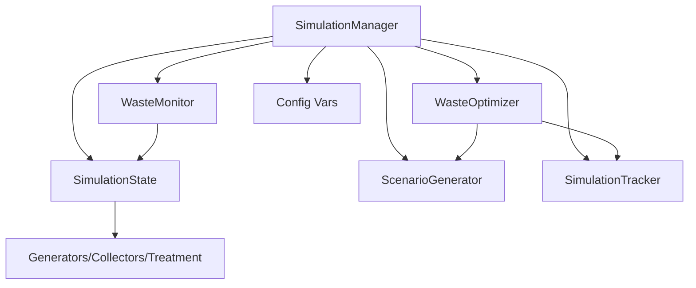
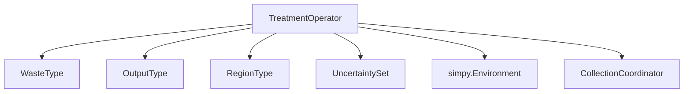
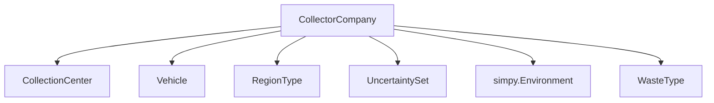
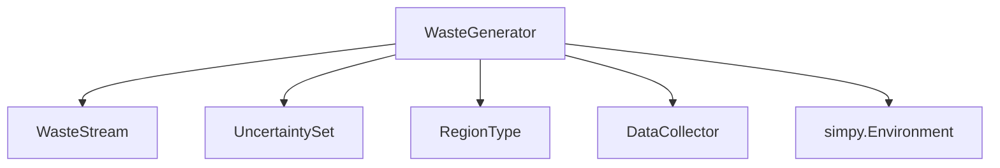

# DES Model Documentation

## core/simulation_manager.py

### Purpose

Manages the setup, execution, optimization, and monitoring of the entire simulation. Orchestrates entity initialization, process scheduling, optimization, and state tracking.

### Influential Variables

| Variable                | Type                | Range/Source         | Impact                                                                 |
|-------------------------|---------------------|----------------------|------------------------------------------------------------------------|
| `env`                   | simpy.Environment   | -                    | Simulation time and event management                                   |
| `waste_monitor`         | WasteMonitor        | -                    | Collects and visualizes waste data                                     |
| `state`                 | SimulationState     | -                    | Centralized state for all simulation entities                          |
| `initial_params`        | dict                | Entity configs       | Stores initial collection and processing rates for comparison          |
| `optimizer`             | WasteOptimizer      | -                    | Runs optimization algorithms for system objectives                     |
| `scenario_generator`    | ScenarioGenerator   | -                    | Generates uncertainty scenarios and adjusts parameters                 |
| `tracker`               | SimulationTracker   | -                    | Records simulation snapshots and metadata                              |
| `SIMULATION_DURATION`   | int                 | config/base_config   | Total simulation time units                                            |
| `TIME_PERIOD`           | int                 | config/base_config   | Time units per simulation year                                         |
| `TOTAL_YEARS`           | int                 | config/base_config   | Number of simulation years                                             |

#### Key Dynamic Variables (via state or process)

| Variable                | Type                | Range/Source         | Impact                                                                 |
|-------------------------|---------------------|----------------------|------------------------------------------------------------------------|
| `collection_rates`      | dict[str, float]    | Entity attribute     | Frequency of waste collection per collector                            |
| `processing_rates`      | dict[str, float]    | Entity attribute     | Processing time per treatment operator                                 |
| `storage_levels`        | dict[str, float]    | Entity attribute     | Current storage per generator/treatment operator                       |
| `objective_scores`      | dict[str, float]    | Optimizer result     | Scores for each optimization objective                                 |
| `metrics`               | dict[str, float]    | Calculated           | Aggregated system performance metrics                                  |

### Relationships

## core/treatment.py

### Purpose

Implements the TreatmentOperator entity, responsible for processing waste into products. Handles storage, processing capacity, transformation pathways, efficiency, and demand-driven collection.

### Influential Variables

| Variable                   | Type                                  | Range/Source         | Impact                                                                 |
|----------------------------|---------------------------------------|----------------------|------------------------------------------------------------------------|
| `env`                      | simpy.Environment                     | -                    | Simulation time and event management                                   |
| `name`                     | str                                   | -                    | Unique identifier for the treatment operator                           |
| `processing_capacity`      | float                                 | Derived              | Max waste processed per cycle (dynamic, based on storage and time)     |
| `processing_time`          | float/int                             | Initial config       | Time units per processing cycle                                        |
| `storage_capacity`         | float/int                             | Initial config       | Maximum waste storage                                                  |
| `min_capacity`             | float                                 | Derived              | Minimum allowed storage capacity                                       |
| `max_capacity`             | float                                 | Derived              | Maximum allowed storage capacity                                       |
| `energy_consumption`       | float                                 | Initial config       | Energy used per processing cycle                                       |
| `environmental_impact`     | float                                 | Initial config       | Environmental impact score                                             |
| `conversion_rate`          | float                                 | Initial config       | Waste-to-product conversion ratio                                      |
| `operational_costs`        | float                                 | Initial config       | Cost per processing cycle                                              |
| `region`                   | str                                   | Initial config       | Region name (for reporting/tracking)                                   |
| `region_type`              | RegionType                            | Derived              | Enum for region                                                        |
| `uncertainty_set`          | UncertaintySet/None                   | Scenario config      | Controls stochasticity and failure rates                               |
| `utilization_history`      | list[float]                           | Dynamic              | Rolling window of storage utilization                                 |
| `demand`                   | float                                 | Dynamic              | Current demand for products                                            |
| `total_products_created`   | float                                 | Dynamic              | Cumulative products created                                            |
| `demand_history`           | list[tuple]                           | Dynamic              | Historical demand data                                                 |
| `production_history`       | list[float]                           | Dynamic              | Historical production data                                             |
| `waste_storage`            | dict[WasteType, float]                | Dynamic              | Current waste storage by type                                          |
| `processed_volumes`        | dict[WasteType, float]                | Dynamic              | Cumulative processed waste by type                                     |
| `product_volumes`          | dict[str, float]                      | Dynamic              | Cumulative product output by type                                      |
| `rng`                      | np.random.Generator                   | Seeded               | Random number generator for reproducibility                            |
| `process`                  | simpy.Process                         | -                    | Main processing loop                                                   |

### Relationships

## core/collector.py

### Purpose

Implements the CollectorCompany entity, responsible for collecting waste from generators, managing vehicle fleets, scheduling transports, and coordinating with other collectors. Handles collection strategies, storage, and transport logistics.

### Influential Variables

| Variable                | Type                                  | Range/Source         | Impact                                                                 |
|-------------------------|---------------------------------------|----------------------|------------------------------------------------------------------------|
| `env`                   | simpy.Environment                     | -                    | Simulation time and event management                                   |
| `name`                  | str                                   | -                    | Unique identifier for the collector                                    |
| `collection_capacity`   | float/int                             | Initial config       | Maximum waste collected per cycle                                      |
| `collection_frequency`  | float/int                             | Initial config       | Time units between collection events                                   |
| `transport_cost`        | float                                 | Initial config       | Cost per collection/transport event                                    |
| `environmental_impact`  | float                                 | Initial config       | Environmental impact score                                             |
| `efficiency`            | float                                 | 0-1                  | Collection efficiency multiplier                                       |
| `availability`          | bool                                  | Dynamic              | Collector operational status                                           |
| `strategy`              | str                                   | "competitive"/"collaborative" | Collection strategy type                                      |
| `region`                | str                                   | Initial config       | Region name (for reporting/tracking)                                   |
| `region_type`           | RegionType                            | Derived              | Enum for region                                                        |
| `uncertainty_set`       | UncertaintySet/None                   | Scenario config      | Controls stochasticity and failure rates                               |
| `collection_center`     | CollectionCenter                      | Initialized          | Central storage for collected waste                                    |
| `vehicle_capacity`      | float/int                             | Initial config       | Capacity per vehicle                                                   |
| `vehicles`              | list[Vehicle]                         | Initialized          | Fleet of vehicles for transport                                        |
| `active_transports`     | list[dict]                            | Dynamic              | Ongoing waste transports                                               |
| `collected_waste`       | dict[WasteType, float]                | Dynamic              | Cumulative waste collected by type                                     |
| `rng`                   | np.random.Generator                   | Seeded               | Random number generator for reproducibility                            |
| `process`               | simpy.Process                         | -                    | Waste collection process                                               |
| `transport_process`     | simpy.Process                         | -                    | Transport management process                                           |

### Relationships

## core/generator.py

### Purpose

Implements the WasteGenerator entity, responsible for generating waste streams in the simulation. Handles waste generation rates, storage, priority, and seasonal/uncertainty effects.

### Influential Variables

| Variable                | Type                                  | Range/Source         | Impact                                                                 |
|-------------------------|---------------------------------------|----------------------|------------------------------------------------------------------------|
| `env`                   | simpy.Environment                     | -                    | Simulation time and event management                                   |
| `name`                  | str                                   | -                    | Unique identifier for the generator                                    |
| `waste_streams`         | dict[WasteType, WasteStream]          | Initial config       | Tracks waste by type and volume                                        |
| `waste_generation_rates`| dict[WasteType, float]                | Initial config       | Generation rate per waste type                                         |
| `generation_frequency`  | float/int                             | Initial config       | Time units between waste generation events                             |
| `storage_capacity`      | float/int                             | Initial config       | Maximum storage before overflow                                        |
| `priority_level`        | int                                   | 1-10                 | Determines collection urgency                                          |
| `uncertainty_set`       | UncertaintySet/None                   | Scenario config      | Controls stochasticity in generation                                   |
| `environmental_impact`  | float                                 | Initial config       | Environmental impact score                                             |
| `current_storage`       | float                                 | Dynamic              | Current total stored waste                                             |
| `last_collected`        | float/int                             | Dynamic              | Last collection time                                                   |
| `region`                | str                                   | Initial config       | Region name (for reporting/tracking)                                   |
| `region_type`           | RegionType                            | Derived              | Enum for region                                                        |
| `total_generated`       | dict[WasteType, float]                | Dynamic              | Cumulative waste generated by type                                     |
| `generation_history`    | dict[str, dict[str, np.ndarray]]      | Dynamic              | Historical data for analysis                                           |
| `seasonal_factors`      | np.ndarray                            | Precomputed          | Seasonal adjustment multipliers                                        |
| `rng`                   | np.random.Generator                   | Seeded               | Random number generator for reproducibility                            |
| `action`                | simpy.Process                         | -                    | Waste generation process                                               |

### Relationships

