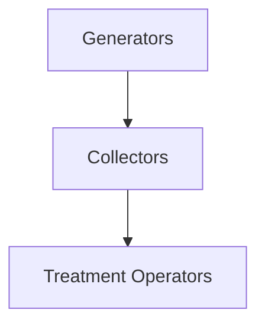

# Discrete-Event Simulation Framework

<!-- Overview section introducing the simulation framework -->
- Framework purpose and scope
- High-level architecture diagram



- Key simulation concepts and terminology
- Core technologies used (SimPy, Python)

## Model Architecture and Design

### System Overview

- Conceptual model structure and components
- System boundaries and scope
- Integration patterns between components

### Technical Architecture

- Class hierarchy and relationships
- Event handling and scheduling
- Configuration management approach

#### Implementation Notes

```python
# Example system configuration structure
class SimulationConfig:
    def __init__(self):
        self.simulation_time = 365  # days
        self.random_seed = 42
        # ... other configuration parameters
```

## Entity Modeling

### Generator Entities

The Generator component models waste producers in the system, implementing stochastic waste generation with seasonal variations and failure handling.

#### Key Features
- Stochastic waste generation with configurable uncertainty
- Seasonal production patterns using sinusoidal factors
- Priority-based collection scheduling
- Capacity-aware storage management
- Multi-waste type support with volume tracking
- Failure and recovery simulation

#### Implementation Details

```python
class WasteGenerator:
    def __init__(
        self,
        env,
        name: str,
        waste_streams: Dict[WasteType, float],  # Type -> Generation rate
        generation_frequency: float,
        storage_capacity: float,
        priority_level: int,
        region: str,
        uncertainty_set = None
    ):
        self.env = env
        self.waste_streams = {
            waste_type: WasteStream(waste_type=waste_type, volume=0)
            for waste_type in waste_streams.keys()
        }
        self.waste_generation_rates = waste_streams
        self.storage_capacity = storage_capacity
        self.priority_level = priority_level
        self.region = region
```

#### Generation Process

The waste generation process implements:
- Seasonal variation using sinusoidal factors
- Stochastic daily variations based on uncertainty sets
- Storage capacity constraints and overflow handling
- Efficient history tracking using fixed-size arrays

```python
def generate_waste(self):
    while True:
        season_index = int(self.env.now % self.seasonal_periods)
        seasonal_factor = self.seasonal_factors[season_index]
        
        # Generate waste for each type with uncertainty
        for waste_type, base_rate in self.waste_generation_rates.items():
            volume = base_rate * seasonal_factor * self.daily_factor
            self.waste_streams[waste_type].volume += volume
            
        yield self.env.timeout(self.generation_frequency)
```

#### Priority Management

Generators implement dynamic priority adjustment based on:
- Current storage utilization
- Time since last collection
- Regional demand patterns


### Collector Entities

The Collector component manages waste transportation between generators and treatment facilities, implementing both competitive and collaborative collection strategies.

#### Key Features
- Multi-vehicle fleet management with dynamic routing
- Competitive and collaborative collection strategies
- Region-based collection prioritization
- Real-time transport monitoring and delay handling
- Storage capacity management with overflow protection
- Failure and recovery simulation

#### Implementation Details

```python
class CollectorCompany:
    def __init__(
        self,
        env,
        name: str,
        collection_capacity: float,
        collection_frequency: float,
        transport_cost: float,
        efficiency: float,
        strategy: str = "competitive",
        region: str = None,
        num_vehicles: int = 3
    ):
        self.collection_center = CollectionCenter(
            region=self.region_type,
            storage_capacity=collection_capacity * 2,
            current_storage={waste_type: 0.0 for waste_type in WasteType}
        )
        self.vehicles = [
            Vehicle(id=f"{self.name}_vehicle_{i}", capacity=self.vehicle_capacity)
            for i in range(num_vehicles)
        ]
```

#### Collection Process

The collection process implements:
- Priority-based generator selection
- Capacity-aware waste collection
- Multi-waste type handling
- Transport scheduling and routing

```python
def collect_waste(self):
    while True:
        prioritized_generators = get_prioritized_generators()
        
        if self.strategy == "competitive":
            collection_cost = handle_competitive_collection(
                self, prioritized_generators
            )
        elif self.strategy == "collaborative":
            collection_cost = handle_collaborative_collection(
                self, prioritized_generators
            )
            
        yield self.env.timeout(self.collection_frequency)
```

#### Transport Management

Collectors handle transport logistics through:
- Route optimization using regional distance matrices
- Vehicle allocation and scheduling
- Real-time delay simulation and handling
- Cross-regional waste transfer coordination

```python
def schedule_transport(self, waste_type, volume, target_region):
    route, distance = calculate_transport_route(self.region_type, target_region)
    vehicle = get_available_vehicle(self.vehicles)
    
    if vehicle and route:
        transport_time = distance / 60.0  # Assume 60 km/h
        vehicle.in_transit = True
        vehicle.estimated_arrival = self.env.now + transport_time
```

### Treatment Operator Entities

The Treatment Operator component processes waste into valuable products through sophisticated transformation pathways, implementing demand-driven production planning and resource optimization.

#### Key Features
- Multi-waste type processing capabilities
- Product-specific transformation pathways
- Dynamic efficiency management
- Demand-driven production planning
- Storage capacity management with overflow protection
- Quality-based material allocation for furniture production
- Failure and recovery simulation

#### Implementation Details

```python
class TreatmentOperator:
    def __init__(
        self,
        env,
        name: str,
        processing_time: float,
        storage_capacity: float,
        energy_consumption: float,
        conversion_rate: float,
        operational_costs: float,
        region: str,
        transformations: Dict[WasteType, WasteTransformation] = None
    ):
        self.waste_storage = {waste_type: 0.0 for waste_type in WasteType}
        self.processed_volumes = {waste_type: 0.0 for waste_type in WasteType}
        self.product_volumes = {
            "wooden_furniture": 0.0,
            "wooden_packaging": 0.0,
            "paper_packaging": 0.0
        }
```

#### Processing Logic

The treatment process implements:
- Material quality-based allocation
- Transformation pathway prioritization
- Demand-driven production planning
- Capacity and efficiency management

```python
def run_facility(self):
    while True:
        # Get sorted transformations by priority
        sorted_transformations = self._get_prioritized_transformations()
        
        # Process transformations in priority order
        for (input_type, output_type), transformation in sorted_transformations:
            if self.waste_storage[input_type] > 0:
                self._process_waste_transformation(
                    input_type, output_type, transformation
                )
        
        yield self.env.timeout(self.processing_time)
```

#### Transformation Management

Treatment operators handle material transformations through:
- Quality-based material reservation for furniture
- Dynamic efficiency adjustment
- Multi-stage processing pathways
- Product-specific optimization

```python
def _process_waste_transformation(self, input_type, output_type, transformation):
    # Calculate material reservation for furniture
    if input_type in furniture_materials and furniture_demand > 0:
        reserved_amount = self.waste_storage[input_type] * 0.4  # 40% for furniture
        
    # Get transformation efficiency with uncertainty
    efficiency = get_transformation_efficiency(self, input_type, transformation)
    
    # Process material with capacity constraints
    amount_to_process, output_amount = calculate_output_amounts(
        self, amount_to_process, efficiency
    )
```

## System Dynamics and Interactions

### Collection Coordination

The CollectionCoordinator manages interactions between treatment facilities and collectors, implementing demand-driven waste collection.

#### Key Features
- Region-based collection coordination
- Demand-driven waste requests
- Storage capacity management
- Priority-based waste type handling

```python
class CollectionCoordinator:
    def request_collection(self, required_waste: float, input_waste_types: set) -> CollectionResult:
        collectors_with_stored_waste = self._get_collectors_with_waste(state)
        collectors_for_collection = self._get_available_collectors(state)
        
        # First use stored waste
        total_collected = self._transfer_stored_waste(
            collectors_with_stored_waste, 
            required_waste,
            total_by_type,
            input_waste_types
        )
        
        # Then request additional collection if needed
        if total_collected < required_waste:
            total_collected = self._request_additional_collection(
                collectors_for_collection,
                required_waste,
                total_collected,
                total_by_type
            )
```

### Resource Management

The system implements sophisticated resource management across all components:

#### Storage Management
- Dynamic capacity adjustments
- Overflow protection
- Multi-waste type storage tracking
- Priority-based space allocation

```python
class StorageDict(dict):
    def __setitem__(self, key, value):
        result = apply_capacity_constraints(
            sum(v for k, v in self.items() if k not in excluded_keys),
            value,
            self.owner.storage_capacity
        )
        if result.overflow_amount > 0:
            handle_overflow_generic(
                self.owner.data_collector,
                "treatment",
                result.overflow_amount,
                "landfill",
                self.owner.env.now
            )
        super().__setitem__(key, result.allowed_amount)
```

### Transportation Logic

The system implements sophisticated transportation management:

#### Vehicle Fleet Management
- Dynamic vehicle allocation
- Route optimization using distance matrices
- Real-time delay simulation
- Cross-regional coordination

#### Routing Strategy
| Component | Strategy | Implementation |
|-----------|----------|----------------|
| Collection | Region-based | Priority queues |
| Transport | Distance-optimized | Regional matrices |
| Delivery | Demand-driven | Dynamic scheduling |

### Performance Optimization

The system includes several optimization mechanisms:

#### Capacity Management
- Dynamic storage capacity adjustment
- Utilization-based processing rates
- Vehicle fleet optimization

#### Efficiency Improvements
- Material quality-based allocation
- Priority-based scheduling
- Collaborative collection strategies

## SimPy Implementation

### Facility Builder

The FacilityBuilder class manages entity creation and initialization:

```python
class FacilityBuilder:
    def build_all_facilities(self) -> Tuple[List, List, List]:
        """Build all simulation entities from configuration"""
        generators = []
        collectors = []
        processors = []

        for region in RegionType:
            facilities = self.facility_manager.get_region_facilities(region)
            if facilities:
                # Create regional entities
                generators.extend([
                    self.create_generator(gen_data, region)
                    for gen_data in facilities.generators
                ])
                collectors.extend([
                    self.create_collector(col_data, region)
                    for col_data in facilities.collectors
                ])
                processors.extend([
                    self.create_processor(proc_data, region)
                    for proc_data in facilities.processors
                ])

        return generators, collectors, processors
```

### Simulation Initialization

The system provides flexible initialization with uncertainty handling:

```python
def initialize_simulation_entities(
    env: Environment,
    uncertainty_set = None,
    data_collector: DataCollector = None,
    distribution_mode: str = "balanced",
    priority_types: List[str] = None
) -> Tuple[List, List, List]:
    # Load facility data
    facility_manager = FacilityDataManager()
    facility_manager.load_data()
    
    # Create builder and facilities
    builder = FacilityBuilder(env, facility_manager, data_collector)
    generators, collectors, processors = builder.build_all_facilities()
    
    # Distribute production demands
    if distribution_mode == "priority":
        _distribute_with_priority(processor_by_output, national_demand)
    else:
        _distribute_balanced(processor_by_output, national_demand)
        
    return generators, collectors, processors
```

### Process Control

Each entity type implements its own SimPy process control:

#### Generator Process
```python
def generate_waste(self):
    """Generate waste with optimized calculations"""
    while True:
        if not self.is_failed:
            seasonal_factor = self.seasonal_factors[
                int(self.env.now % self.seasonal_periods)
            ]
            self._generate_waste_for_period(seasonal_factor)
        yield self.env.timeout(self.generation_frequency)
```

#### Collection Process
```python
def collect_waste(self):
    """Collection process with strategy handling"""
    while True:
        if self.is_operational:
            prioritized_generators = get_prioritized_generators()
            self._handle_collection_strategy(prioritized_generators)
        yield self.env.timeout(self.collection_frequency)
```

#### Treatment Process
```python
def run_facility(self):
    """Process waste transformations by priority"""
    while True:
        if self.is_operational:
            sorted_transformations = self._get_prioritized_transformations()
            self._process_transformations(sorted_transformations)
        yield self.env.timeout(self.processing_time)
```

### Performance Optimizations

The implementation includes several performance optimizations:

#### Memory Management
- Fixed-size arrays for history tracking
- Efficient data structures for state management
- Optimized collection queues

#### Process Coordination
- Event-based coordination using SimPy events
- Asynchronous process communication
- Priority-based scheduling

#### Resource Management
- Dynamic capacity allocation
- Efficient resource pooling
- Optimized constraint checking

## Appendix

### Configuration Reference

The system uses a hierarchical configuration structure:

#### Facility Configuration
```python
# base_config.py
class FacilityConfig:
    def __init__(self):
        self.storage_capacity: float
        self.processing_time: float
        self.energy_consumption: float
        self.environmental_impact: float
```

#### Cost Configuration
```python
# cost_config.py
class CostConfig:
    transport_cost_per_km: float
    processing_cost_per_unit: float
    storage_cost_per_unit: float
```

### Monitoring and Metrics

The system implements comprehensive monitoring through the DataCollector class:

#### Core Metrics
- Waste generation rates by type and region
- Collection and transport statistics
- Processing efficiency and throughput
- Storage utilization levels
- Cost tracking by operation type

#### Visualization Capabilities
```python
# Implemented plot types
class VisualizationTypes:
    EFFICIENCY_PLOTS = "efficiency"
    PRODUCTION_PLOTS = "production"
    STORAGE_PLOTS = "storage"
    OVERFLOW_PLOTS = "overflow"
    REGIONAL_WASTE_PLOTS = "regional"
    SYSTEM_PLOTS = "system"
```

#### Data Collection Methods
```python
class DataCollector:
    def track_waste_generation(self, region, type, amount):
        """Track waste generation events"""
    
    def track_processing(self, facility, timestamp):
        """Track processing activities"""
    
    def track_transport(self, source, destination, amount):
        """Track transport operations"""
```

### Integration Guide

#### Extension Points

1. Custom Entity Types
```python
class CustomEntity(OperationalEntity):
    """Implement custom entity behavior"""
    def __init__(self, env, config):
        super().__init__()
        self.env = env
        # Custom initialization
```

2. Custom Transformations
```python
class CustomTransformation:
    """Define new transformation pathways"""
    def __init__(self, input_type, output_type, efficiency):
        self.input_type = input_type
        self.output_type = output_type
        self.efficiency = efficiency
```

3. Monitoring Extensions
```python
class CustomMonitor(SystemMonitor):
    """Implement custom monitoring logic"""
    def __init__(self, data_collector):
        super().__init__(data_collector)
        # Custom metrics initialization
```

#### API Integration

The system provides integration points through:
- Configurable data input/output formats
- Event hooks for custom processing
- Extensible visualization system
- Modular component architecture

### Performance Tuning

#### Optimization Parameters
- Collection frequency adjustment
- Storage capacity optimization
- Vehicle fleet sizing
- Processing rate tuning

#### Scaling Considerations
- Regional decomposition
- Parallel process execution
- Memory usage optimization
- Data collection sampling rates
