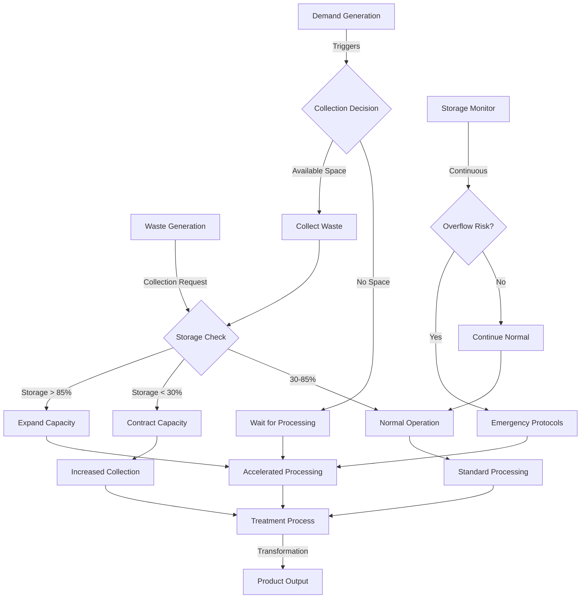

# Wood Waste Management System Behavior Model

## 1. Storage Behavior Model (State-of-the-Art)

### Dynamic Capacity Management
- Utilization-based capacity adjustments
  - Expands up to 2x initial capacity when utilization > 85%
  - Contracts to minimum 75% when utilization < 30%
  - Rolling window monitoring (10 periods)

### Storage Constraints
- Multi-waste type storage system
- Volume-based capacity limits
- Bounded storage utilization (0-100%)

### Storage States
1. **Normal Operation** (30-85% utilization)
   - Standard processing rates
   - Balanced collection requests
2. **Near-Capacity** (>85% utilization)
   - Accelerated processing (30% faster)
   - Reduced collection
   - Capacity expansion triggered
3. **Under-Utilized** (<30% utilization)
   - Slowed processing (30% slower)
   - Increased collection requests
   - Capacity contraction considered

## 2. Treatment Process Model (State-of-the-Art)

### Treatment Pathways
- Waste-specific transformation processes
- Conversion efficiencies by type:
  - Sawdust → Mixed Wood (95% efficiency)
  - Wood Cuttings → Mixed Wood (90% efficiency)
  - Bark → Mixed Wood (85% efficiency)
  - Cork → Mixed Wood (92% efficiency)
  - Solid Wood → Mixed Wood (98% efficiency)
  - Paper Packaging → Mixed Wood (80% efficiency)
  - Wood Packaging → Mixed Wood (88% efficiency)

### Processing Dynamics
- Batch processing (40% of current storage per cycle)
- Energy consumption tracking
- Quality-dependent conversion rates
- Environmental impact monitoring

### Treatment States
1. **High-Volume Processing**
   - Triggered by storage > 80% capacity
   - Increased processing capacity
   - Higher energy consumption
2. **Standard Processing**
   - Normal operation mode
   - Balanced energy usage
3. **Low-Volume Processing**
   - Triggered by storage < 20% capacity
   - Reduced processing capacity
   - Energy conservation

## 3. Ordering Mechanism

### Demand Generation
- Base demand calculation:
  ```
  base_demand = processing_capacity * conversion_rate
  ```

### Demand Adjustment Factors
1. **Storage-Based**
   - Low storage (<30%): 100-120% of base demand
   - Normal storage: 80-120% of base demand
   - High storage (>70%): 60-80% of base demand

2. **Capacity Constraints**
   - Maximum: 50% of storage capacity
   - Minimum: 10 units

### Collection Triggering
- Threshold-based collection requests
- Regional prioritization
- Collector availability checking

## 4. Inventory Management (State-of-the-Art)

### Dynamic Inventory Control
1. **Fixed Parameters**
   - Initial storage capacity
   - Processing capacity
   - Transformation efficiencies

2. **Variable Parameters**
   - Current storage levels by waste type
   - Processing rates
   - Collection frequencies

### Inventory States
1. **Optimal Zone** (40-60% capacity)
   - Standard operations
   - Balanced collection/processing
2. **Buffer Zone** (20-40% or 60-80% capacity)
   - Adjusted operations
   - Modified collection rates
3. **Critical Zone** (<20% or >80% capacity)
   - Emergency measures
   - Extreme rate adjustments

## 5. Production and Overflow Management

### Production Control
1. **Normal Production**
   - Standard processing rates
   - Regular energy consumption
2. **Accelerated Production**
   - 30% faster processing
   - Increased energy usage
3. **Reduced Production**
   - 30% slower processing
   - Energy conservation

### Overflow Prevention
1. **Early Warning System**
   - Storage utilization monitoring
   - Rolling window analysis
2. **Prevention Measures**
   - Dynamic capacity adjustment
   - Collection rate modification
   - Processing rate adjustment
3. **Emergency Protocols**
   - Rapid processing activation
   - Collection suspension
   - Capacity expansion

## Flow Chart



## Operating Modes

### Fixed Parameter Mode
- Static storage capacity
- Fixed processing rates
- Constant transformation efficiencies
- Benefits: Predictable behavior, easier to optimize

### Dynamic Parameter Mode
- Adaptive storage capacity
- Variable processing rates
- Efficiency-based transformations
- Benefits: Better resource utilization, handles variability

## Performance Metrics

1. **Storage Efficiency**
   - Utilization rate
   - Capacity adjustment frequency
   - Overflow incidents

2. **Treatment Efficiency**
   - Conversion rates
   - Energy consumption
   - Processing time

3. **System Performance**
   - Demand satisfaction rate
   - Collection efficiency
   - Environmental impact

## Model Validation

The behavior model can be validated through:
1. Historical data comparison
2. Scenario testing
3. Sensitivity analysis
4. Performance metrics tracking
5. System stability assessment
